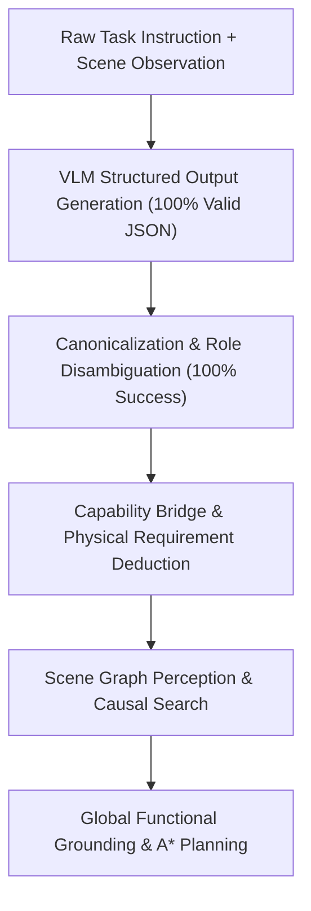

# End-to-End Semantic Funnel Analysis

Tracking preservation of semantic intent across the six stages of the Functional-TAMP funnel:

## Stage-by-Stage Funnel Metrics

| Funnel Stage | Development 32x1 | Held-Out 15x1 | Key Observations |
| :--- | :---: | :---: | :--- |
| **1. Structured Output Reliability** | **100.0% (32/32)** | **100.0% (15/15)** | Zero syntax errors, zero schema rejections, zero token truncations (`finish_reason: "stop"` on all 47 requests). |
| **2. Role Extraction & Canonicalization** | **100.0% (32/32)** | **100.0% (15/15)** | Qwen paraphrases successfully mapped across all three domains without crash or schema violation. |
| **3. Raw Role Recall** | **69.8%** | **65.6%** | Kitchen: 95.8% / 90.0%; Workshop: 66.7% / 66.7%; Living Room: 41.7% / 40.0%. |
| **4. Verified Candidate Grounding** | **N/A (Dev)** | **80.0% (Living)** | Living room reached complete verified candidate binding for HL1–HL4. |
| **5. Plan Generation (Non-Empty)** | **3.1% (K1)** | **0.0%** | K1 reached full global grounding and synthesized a valid 24-step symbolic plan. |
| **6. Plan Validity (Independent Replay)** | **100.0% (1/1)** | **N/A** | K1 generated plan verified with zero precondition or effect violations. |
| **7. VLM Invariants** | **1.00 calls / 0.00 replans** | **1.00 calls / 0.00 replans** | Pure one-shot execution with zero runtime retries. |
