# Integrated Scene Variant Catalogue

This document is the paper-facing catalogue of the **36 controlled scene
configurations** used by the three main integrated environments:

| Environment | Variants | Feasible | Infeasible |
| --- | ---: | ---: | ---: |
| Kitchen | 16 | 10 | 6 |
| Living Room | 10 | 6 | 4 |
| Workshop | 10 | 8 | 2 |
| **Total** | **36** | **24** | **12** |

These are authored benchmark configurations, not every mathematical
permutation of all objects. Each variant keeps the task instruction fixed and
changes physical object placement, region placement, object availability,
geometry, or compatibility in a controlled way.

Kitchen and Living-Room GT planning/execution readiness, validation totals,
assisted-execution semantics, videos, and VLM handoff are documented in
[`KITCHEN_LIVING_ROOM_PIPELINE_READINESS.md`](KITCHEN_LIVING_ROOM_PIPELINE_READINESS.md).
The equivalent final Workshop closure is documented in
[`WORKSHOP_PIPELINE_READINESS.md`](WORKSHOP_PIPELINE_READINESS.md).

## What feasible and infeasible mean

**Feasible** means that at least one complete assignment exists after all
allowed regions have been inspected. Every task requirement must be satisfied
simultaneously by physically present objects and regions. Semantic suitability
alone is insufficient: relevant geometry, reach, fit, target coverage,
distinctness, context, and global non-conflict constraints must also hold.

**Infeasible** means that no complete assignment exists even after exhaustive
inspection. This is an oracle property of the physical scene, not merely a
detector miss. Each `I*` variant introduces a controlled failure such as a
missing required object, unsuitable geometry, inadequate region capacity, or
a global assignment conflict.

The benchmark's predicted feasible/infeasible label is correct only when it
matches this privileged scene oracle. Feasibility does **not** by itself mean
that a robot motion plan was executed; it establishes that the required
object/region assignment exists.

## Reading the catalogue

- Coordinates are world-frame `(x, y, z)` values in metres.
- `counter_spot_*` is a deterministic Kitchen countertop pose.
- Kitchen storage regions are inspected in order `D1`, `D2`, `C2`, `B1`,
  `C1`. An empty list means that the variant declares no object in that region.
- Living Room uses exactly three fixed destination regions: two individual side
  tables and one shared coffee table. Payloads otherwise begin on staging.
- Workshop storage objects begin inside `LEFT_DRAWER`, `RIGHT_DRAWER`, or
  `TOOL_CABINET`. Its workbench hole is a fixed target, not a varying role.
- Each image is the initial scene snapshot. Closed storage contents may not be
  visible in that image; the accompanying placement list is the authoritative
  construction-time inventory.

---

# 1. Kitchen: 16 variants

## Task and feasibility rule

The task is to prepare coffee and soup for three people: provide three valid
coffee vessels, three valid soup vessels, coffee-stirring tool coverage for
all coffee targets, and a **distinct** compatible utensil for each soup bowl.
A scene is feasible only if all four requirements can be satisfied together.

Authoritative definition:
[`kitchen_feasibility_variants.yaml`](../mujoco_scenes/configs/kitchen_feasibility_variants.yaml).

## Kitchen region and coordinate key

| Counter slot | World position | Counter slot | World position |
| --- | --- | --- | --- |
| 12 | `(0.31, -0.34, 0.58)` | 13 | `(-0.55, -0.34, 0.58)` |
| 14 | `(-0.35, -0.34, 0.58)` | 15 | `(-0.10, -0.32, 0.58)` |
| 16 | `(0.16, -0.32, 0.58)` | 17 | `(-0.52, -0.10, 0.58)` |
| 18 | `(-0.25, -0.10, 0.58)` | 19 | `(0.02, -0.10, 0.58)` |
| 20 | `(0.29, -0.10, 0.58)` | 21 | `(-0.52, -0.39, 0.58)` |
| 22 | `(-0.34, -0.39, 0.58)` | 23 | `(-0.08, -0.39, 0.58)` |
| 24 | `(-0.48, -0.23, 0.58)` | 25 | `(-0.20, -0.23, 0.58)` |
| 26 | `(0.08, -0.23, 0.58)` | 41 | `(-0.60, -0.08, 0.58)` |
| 44 | `(-0.37, -0.08, 0.58)` | 45 | `(-0.14, -0.08, 0.58)` |
| 47 | `(-0.62, -0.30, 0.58)` | 48 | `(-0.40, -0.30, 0.58)` |
| 49 | `(-0.10, -0.30, 0.58)` | 50 | `(0.15, -0.29, 0.58)` |
| 51 | `(0.27, -0.29, 0.58)` | 52 | `(0.48, -0.31, 0.58)` |
| 53 | `(0.49, -0.08, 0.58)` | | |

Object identifiers are descriptive simulator asset IDs. For example,
`narrow_deep_cup`, `medium_deep_mug`, and `wide_shallow_cup` are coffee-vessel
candidates; `shallow_bowl`, `deep_bowl`, and `narrow_deep_bowl` are soup-vessel
candidates. Spoon IDs encode the geometry that determines target compatibility.

## K-F0: `F0_REUSE_ONE` — FEASIBLE

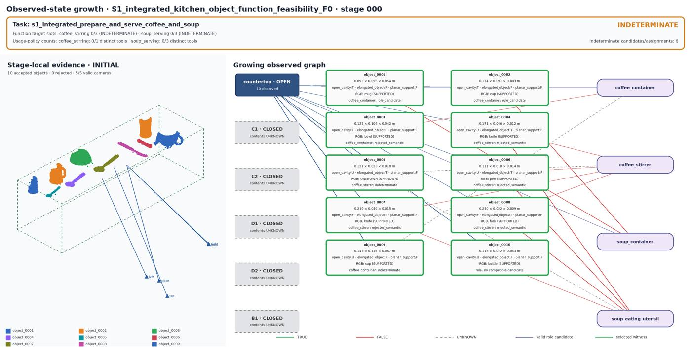

- **Countertop:** 41 `ab3_narrow_deep_cup`; 44 `ab3_medium_deep_mug`; 45
  `ab3_shallow_bowl`; 47 `ab3_short_narrow_spoon`; 48 `ab3_medium_spoon`; 49
  `ab3_long_wide_spoon`; 50 `ab3_long_narrow_fork`; 51 `marker`; 52
  `s1i_compact_kettle`; 53 `s1i_compact_coffee_jar`.
- **D1:** `s1i_oversized_spoon`, `napkin`.
- **D2:** `ab3_partial_spoon`, `tongs`.
- **C2:** `s1i_c2_soup_spoon`, `s1i_wide_shallow_cup`.
- **B1:** `s1i_coffee_near_miss_spoon`, `ab3_deep_bowl`.
- **C1:** `s1i_final_long_narrow_spoon`, `s1i_narrow_deep_bowl`.
- **Why feasible:** after late discovery, one compatible tool covers all coffee
  targets and three distinct soup-tool assignments exist.

## K-F1: `F1_INITIAL_COMPLETE` — FEASIBLE

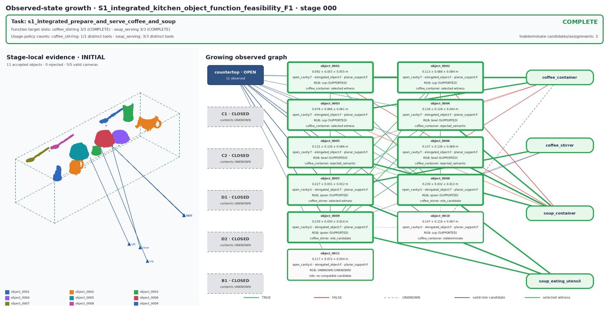

- **Countertop:** 13 `ab3_narrow_deep_cup`; 14 `ab3_medium_deep_mug`; 15
  `s1i_wide_shallow_cup`; 16 `ab3_shallow_bowl`; 25 `ab3_deep_bowl`; 26
  `s1i_narrow_deep_bowl`; 17, 18, and 20 each contain
  `s1i_final_long_narrow_spoon`; 52 `s1i_compact_kettle`; 53
  `s1i_compact_coffee_jar`.
- **D1:** `s1i_oversized_spoon`, `napkin`; **D2:** `ab3_partial_spoon`,
  `tongs`; **C2:** `sugar_jar`; **B1:** `tea_box`; **C1:** `glass`.
- **Why feasible:** all six vessels and three universal utensils are visible at
  the initial stage, so no storage inspection is required.

## K-F2: `F2_DISTRIBUTED_COFFEE_TWO` — FEASIBLE

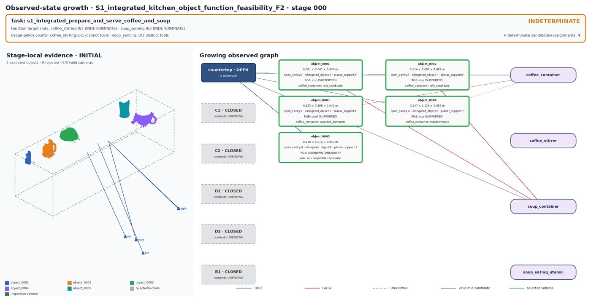

- **Countertop:** 41 `feas_coffee_small_shallow_cup`; 44
  `ab3_medium_deep_mug`; 45 `ab3_shallow_bowl`; 52 kettle; 53 coffee jar.
- **D1:** `s1i_oversized_spoon`, `napkin`; **D2:** `ab3_partial_spoon`,
  `tongs`; **C2:** `s1i_c2_soup_spoon`, `feas_coffee_wide_very_deep_cup`;
  **B1:** `ab3_deep_bowl`; **C1:** `s1i_narrow_deep_bowl`.
- **Why feasible:** no single coffee tool covers every target, but two tools
  jointly provide complete coffee coverage; the soup matching also completes.

## K-F3: `F3_DISTRIBUTED_COFFEE_THREE` — FEASIBLE

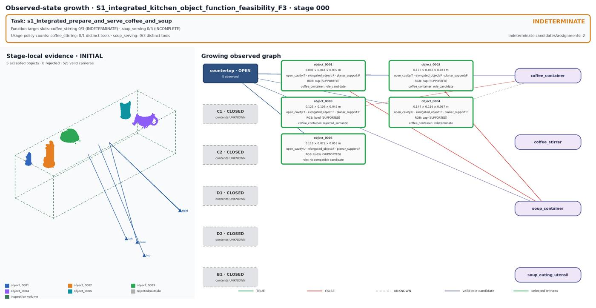

- **Countertop:** 41 `feas_coffee_small_shallow_cup`; 44
  `feas_coffee_extra_deep_mug`; 45 `ab3_shallow_bowl`; 52 kettle; 53 coffee jar.
- **D1:** `s1i_oversized_spoon`, `napkin`; **D2:** `ab3_partial_spoon`,
  `tongs`; **C2:** `feas_c2_medium_spoon`,
  `feas_coffee_wide_very_deep_cup`; **B1:** `ab3_deep_bowl`; **C1:**
  `s1i_narrow_deep_bowl`.
- **Why feasible:** three mutually necessary coffee tools collectively cover
  the three target geometries; a complete soup assignment remains possible.

## K-F4: `F4_EARLY_RELOCATION` — FEASIBLE

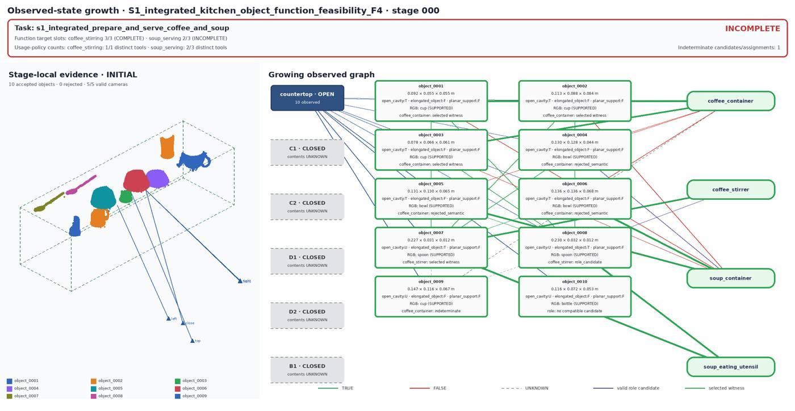

- **Countertop:** vessels at 13–16, 25, and 26; universal spoons at 17 and 18;
  kettle at 52; coffee jar at 53.
- **D2:** `ab3_partial_spoon`, `tongs`. **D1, C2, B1, C1:** empty.
- **Why feasible:** two serving tools begin visible and the final required tool
  is found early, in D2.

## K-F5: `F5_LATE_RELOCATION` — FEASIBLE

- **Countertop:** identical functional layout to K-F4.
- **C1:** `s1i_final_long_narrow_spoon`. **D1, D2, C2, B1:** empty.
- **Why feasible:** the final serving tool exists, but is deliberately moved to
  the last inspected region, testing search-stage invariance.

## K-F6: `F6_DECOY_HEAVY` — FEASIBLE

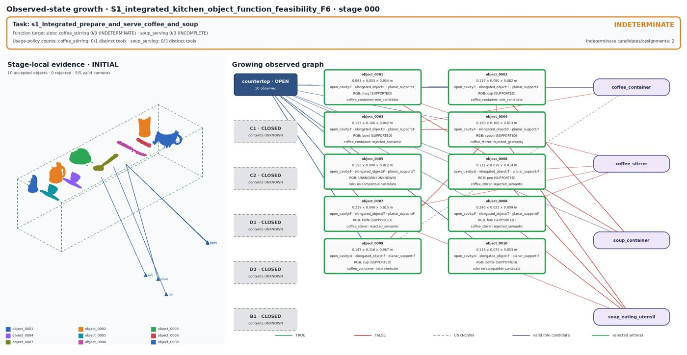

- **Countertop:** same as K-F0 except slots 47 and 48 contain
  `feas_semantic_decoy_spoon` instances.
- **Storage:** identical to K-F0.
- **Why feasible:** the visible spoon-looking decoys fail geometry, but the
  valid late-discovered assignment still exists.

## K-F7: `F7_COUNT_SURPLUS` — FEASIBLE

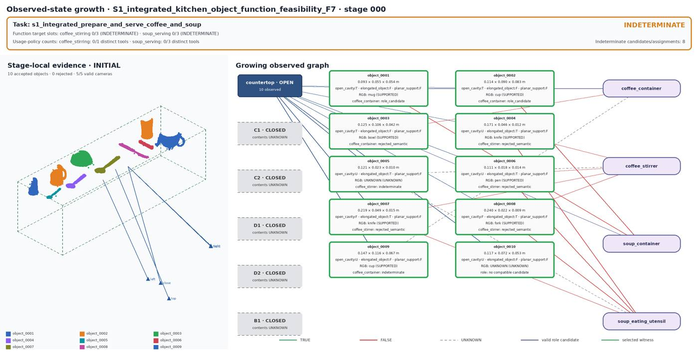

- **Countertop:** identical to K-F0.
- **D1:** `s1i_oversized_spoon`, `ab3_medium_spoon`; **D2:**
  `ab3_partial_spoon`, `s1i_c2_soup_spoon`; **C2:** `s1i_c2_soup_spoon`,
  `s1i_wide_shallow_cup`; **B1:** `s1i_coffee_near_miss_spoon`,
  `ab3_deep_bowl`; **C1:** `s1i_final_long_narrow_spoon`,
  `s1i_narrow_deep_bowl`.
- **Why feasible:** surplus compatible tools exist, while the optimal coffee
  witness still uses the minimum required number of tools.

## K-I0: `I0_MISSING_COFFEE_VESSEL` — INFEASIBLE

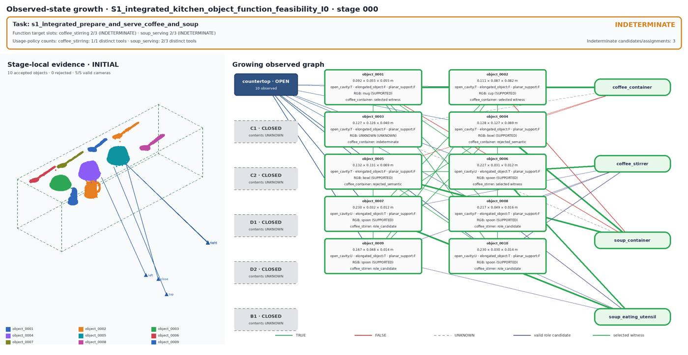

- **Countertop:** spoons at 12 and 17–20; coffee vessels only at 21 and 22;
  soup vessels at 24–26. Slot 23 is deliberately absent.
- **C1:** empty; no replacement third coffee vessel exists in storage.
- **Why infeasible:** only two coffee vessels exist; the task requires three.

## K-I1: `I1_MISSING_SOUP_VESSEL` — INFEASIBLE

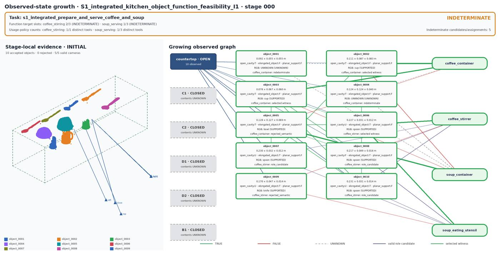

- **Countertop:** spoons at 12 and 17–20; coffee vessels at 21–23; soup
  vessels only at 24 and 25. Slot 26 is deliberately absent.
- **D1:** oversized spoon, napkin; **D2:** partial spoon, tongs; **C2:** sugar
  jar; **B1:** tea box; **C1:** glass.
- **Why infeasible:** only two soup vessels exist; the task requires three.

## K-I2: `I2_UNCOVERED_COFFEE_TARGET` — INFEASIBLE

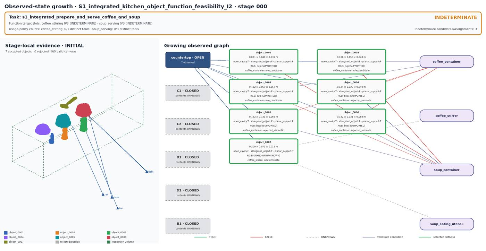

- **Countertop:** coffee vessels at 21–23, soup vessels at 24–26, and
  `feas_soup_wide_medium_spoon` at 19.
- **D1:** two `feas_soup_wide_medium_spoon`; **D2:**
  `feas_narrow_short_spoon`; **C2:** `feas_medium_spoon`; **B1/C1:** empty.
- **Why infeasible:** the third coffee vessel has no compatible tool edge,
  even after taking the union of every available tool.

## K-I3: `I3_ONLY_TWO_SOUP_TOOLS` — INFEASIBLE

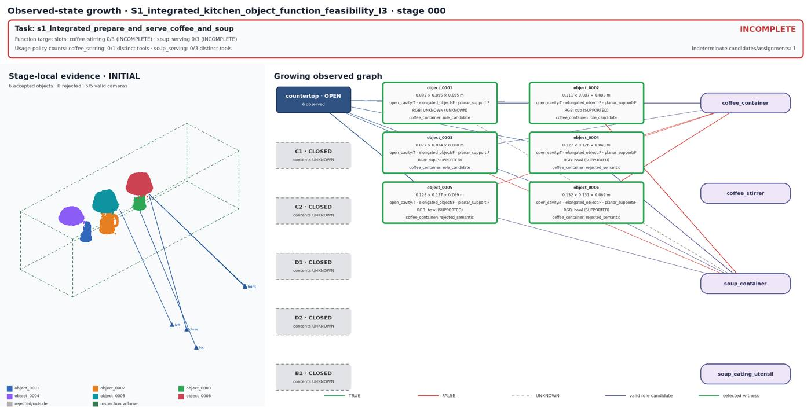

- **Countertop:** coffee vessels at 21–23 and soup vessels at 24–26.
- **D1:** one universal spoon; **D2:** one universal spoon; **C2/B1/C1:** empty.
- **Why infeasible:** coffee is coverable, but only two distinct soup utensils
  exist for three soup bowls.

## K-I4: `I4_SOUP_MATCHING_TRAP` — INFEASIBLE

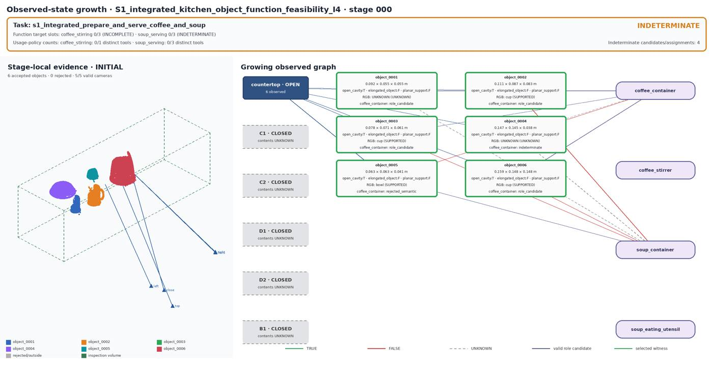

- **Countertop:** coffee vessels at 21–23; specialized soup bowls at 24–26.
- **D1:** universal long narrow spoon; **D2:** wide short spoon; **C2:** wide
  short spoon; **B1/C1:** empty.
- **Why infeasible:** every bowl is individually compatible with some spoon,
  but no one-to-one matching covers all three bowls (Hall-condition failure).

## K-I5: `I5_SEMANTIC_DECOY_GEOMETRY_FAILURE` — INFEASIBLE

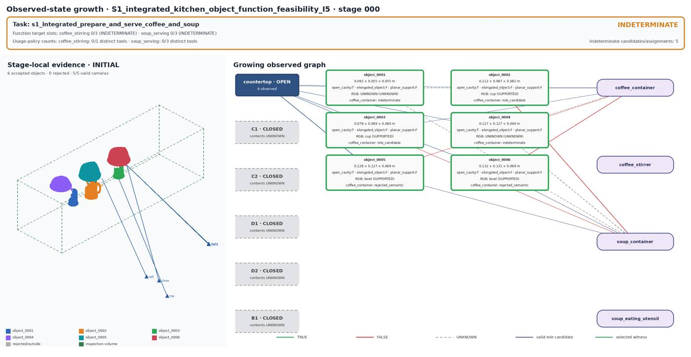

- **Countertop:** coffee vessels at 21–23 and soup vessels at 24–26.
- **D1, D2, C2:** one `feas_semantic_decoy_spoon` each; **B1/C1:** empty.
- **Why infeasible:** all three candidates look spoon-like semantically but
  fail the exact geometry needed to cover the coffee targets.

## K-P0: `P0_LAYOUT_BASE` — FEASIBLE

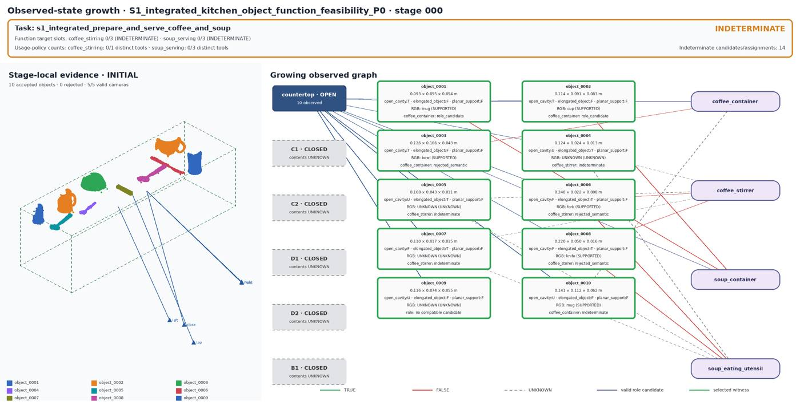

- **Countertop:** 41 cup; 44 mug; 45 bowl; 47 medium spoon; 48 short narrow
  spoon; 49 marker; 50 long wide spoon; 51 long narrow fork; 52 coffee jar; 53
  kettle.
- **Storage:** identical to K-F0.
- **Why feasible:** this is the deterministic baseline for the placement
  perturbation experiment; the complete late-discovered assignment exists.

## K-P1: `P1_LAYOUT_SWAPPED` — FEASIBLE

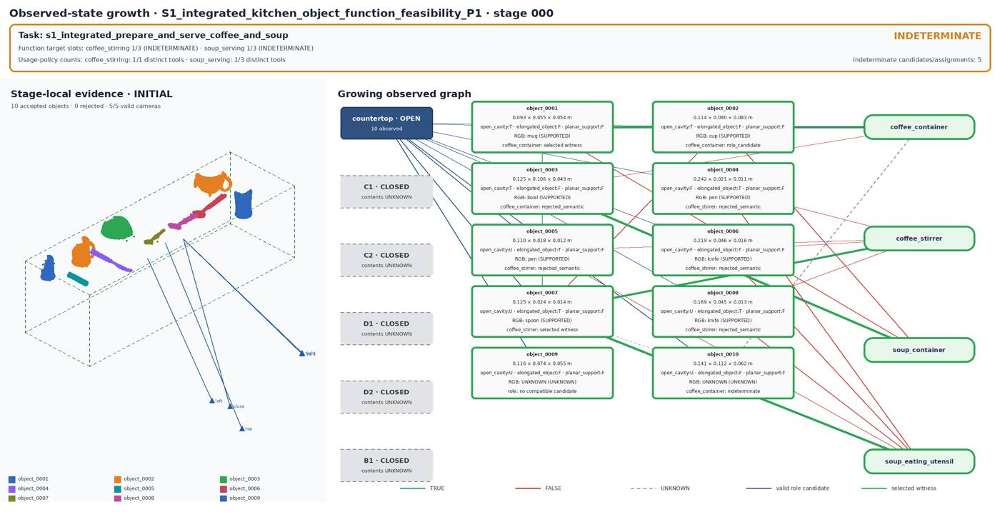

- **Countertop:** 41 cup; 44 mug; 45 bowl; 47 marker; 48 long narrow fork; 49
  short narrow spoon; 50 medium spoon; 51 long wide spoon; 52 coffee jar; 53
  kettle.
- **Storage:** identical to K-P0.
- **Why feasible:** object roster and region membership are unchanged from
  K-P0; only non-overlapping countertop poses are permuted.

---

# 2. Living Room: 10 variants

## Task and feasibility rule

The task is to prepare the room for two people: put one cup and one saucer on
each fixed individual side table and put the TV remote on the fixed shared
coffee table. These three tables are the exhaustive destination-region set.
There is no alternate support, game controller, layout swap, geometry swap, or
decoy-region family.

Authoritative implementation:
[`living_room_region_scene.py`](../mujoco_scenes/living_room_region_scene.py)
and
[`living_room_region_function.py`](../mujoco_scenes/living_room_region_function.py).

## Fixed objects and regions

The object roster is fixed at five: left cup, left saucer, right cup, right
saucer, and TV remote. Feasible variants change only the initial region of the
left cup and/or left saucer. Infeasible variants change only table presence.

The fixed table centres are approximately `PL=(-1.72,1.02)`,
`PR=(1.72,1.02)`, and `SHARED=(0.00,0.62)`. Chairs are fixed close to the
shared table. `STAGING` is the initial source area, not a candidate destination.

## Living Room variant matrix

| Variant | Outcome | Initial object/region change | Reason or required correction |
| --- | --- | --- | --- |
| `F0_ALL_OBJECTS_IN_STAGING` | FEASIBLE | All five objects in `STAGING` | Move both cup/saucer pairs to their individual tables and the remote to `SHARED`. |
| `F1_LEFT_SAUCER_PREPLACED` | FEASIBLE | Left saucer on `PL`; all others in `STAGING` | Saucer is already correct, so only four objects require placement. |
| `F2_LEFT_SAUCER_ON_SHARED` | FEASIBLE | Left saucer on `SHARED`; all others in `STAGING` | Move that saucer to `PL`; place the remaining objects normally. |
| `F3_LEFT_CUP_ON_SHARED` | FEASIBLE | Left cup on `SHARED`; all others in `STAGING` | Move that cup to `PL`; place the remaining objects normally. |
| `F4_SAUCER_PREPLACED_CUP_ON_SHARED` | FEASIBLE | Left saucer on `PL`, left cup on `SHARED` | Keep the correct saucer and move the cup to `PL`. |
| `F5_LEFT_PAIR_ON_SHARED` | FEASIBLE | Left cup and saucer on `SHARED` | Move both to `PL`. |
| `I0_NO_SHARED_TABLE` | INFEASIBLE | `SHARED` absent | No destination exists for the remote. |
| `I1_NO_LEFT_PERSONAL_TABLE` | INFEASIBLE | `PL` absent | Only one individual table exists for two required personal sets. |
| `I2_NO_PERSONAL_TABLES` | INFEASIBLE | `PL` and `PR` absent | Neither cup/saucer set has an individual destination. |
| `I3_NO_TABLES` | INFEASIBLE | `PL`, `PR`, and `SHARED` absent | No required destination table exists. |

## Living Room snapshots

Each snapshot below is the merged five-camera initial observation.

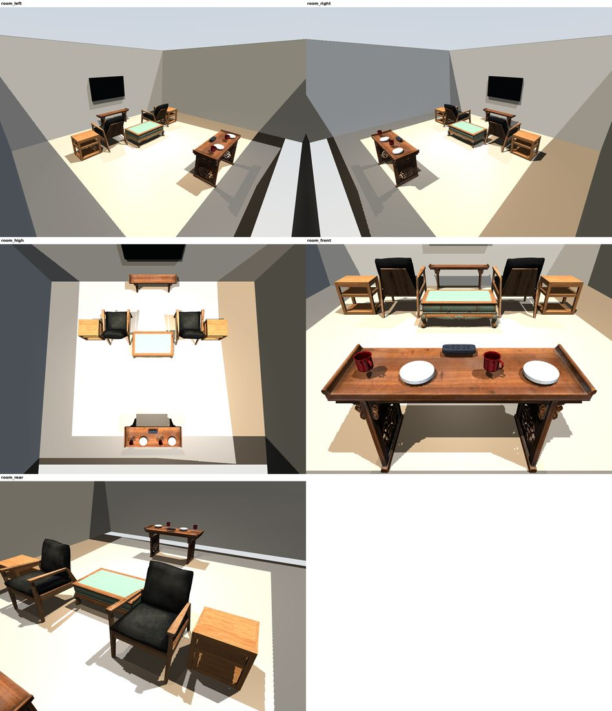
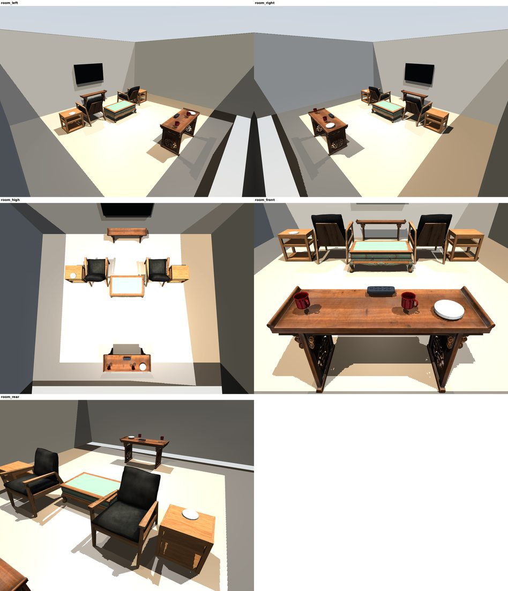

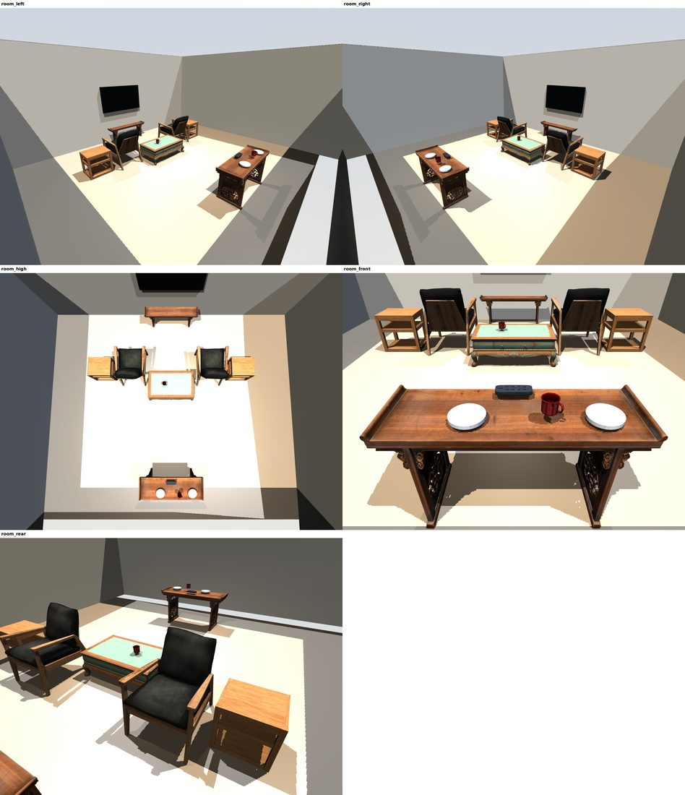

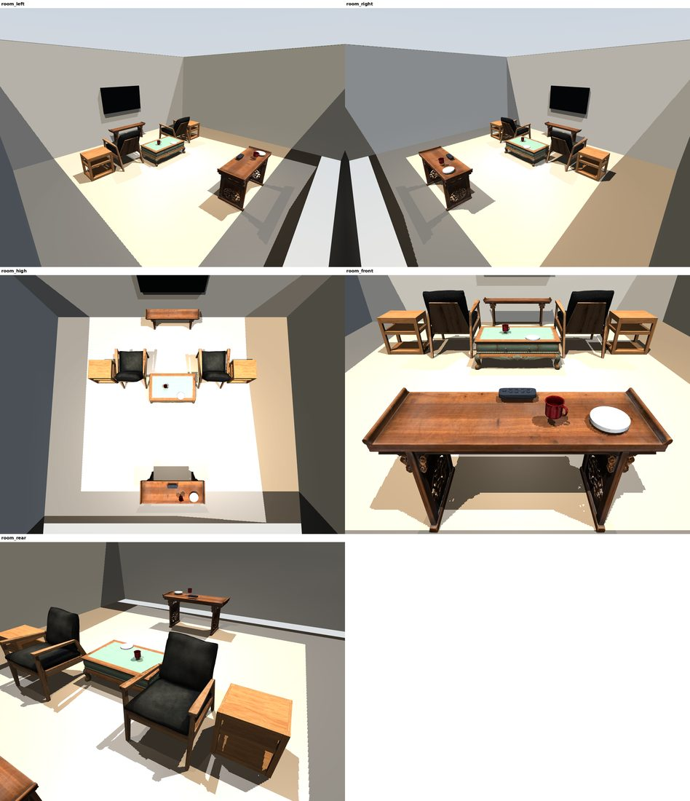
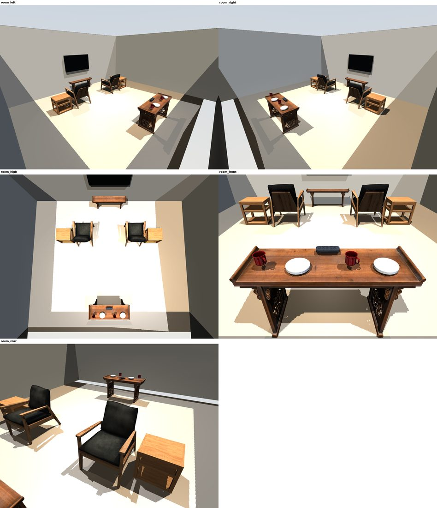
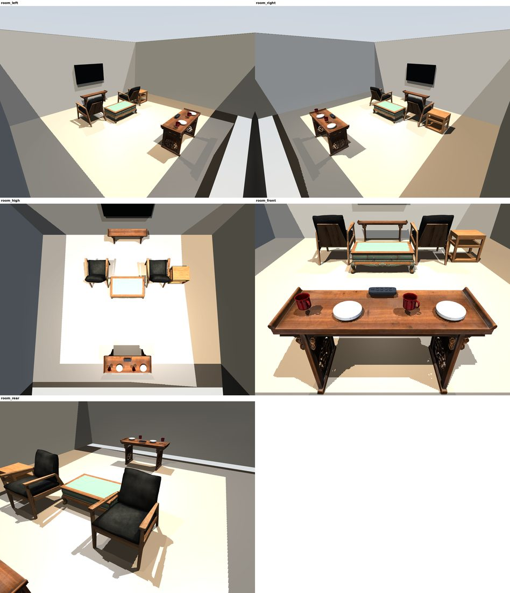
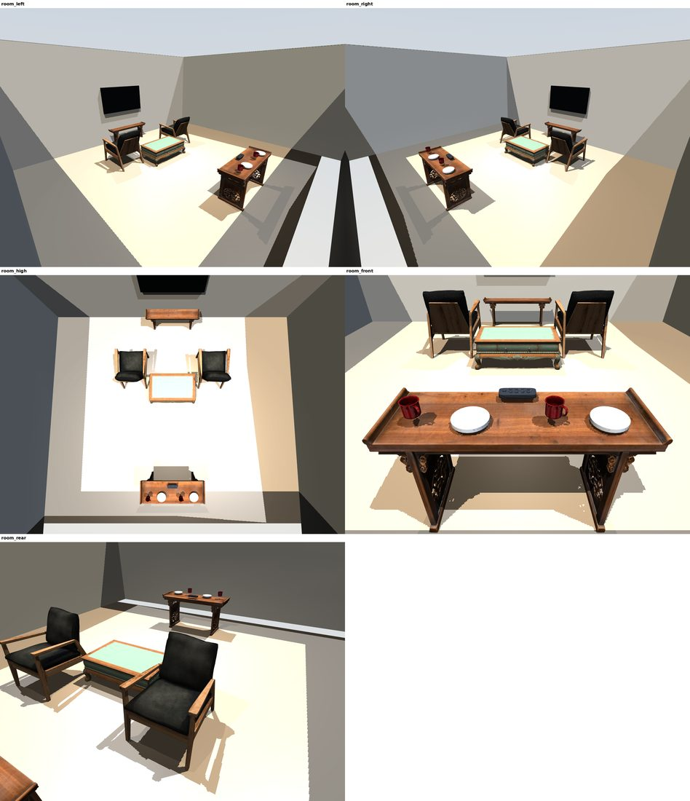
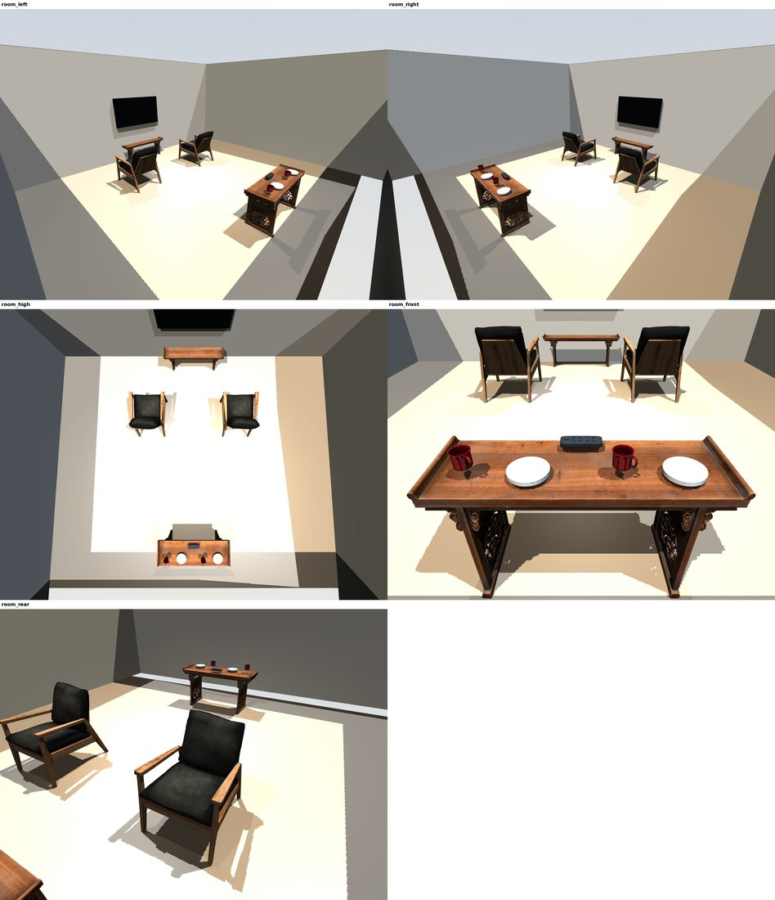

---

# 3. Workshop: retired 14-variant catalogue

> **Retired on 2026-08-23.** The section below is retained only as historical
> provenance and must not be reported as the current benchmark. The current
> Workshop benchmark has 10 fixed-furniture, fixed-object position/presence
> variants. Its authoritative matrix and all five-camera snapshots are in
> [`WORKSHOP_VARIANT_VISUAL_CATALOGUE.md`](WORKSHOP_VARIANT_VISUAL_CATALOGUE.md).

## Task and feasibility rule

The task is to repair a loose frame joint using a compatible driver and
fastener, place the required set on a suitable nearby work surface, and keep
loose small parts in an open parts container. Feasibility requires one
globally compatible tuple:

`(driver, fastener, work surface, parts container)`.

The driver must have the correct function and sufficient shaft geometry, the
fastener must fit the target joint, the selected object set must fit the work
surface, and a valid open parts container must exist.

Authoritative definition:
[`workshop_variants.yaml`](../mujoco_scenes/configs/workshop_variants.yaml).

## Workshop region positions

| Region | Canonical centre `(x,y,z)` m | F6 swapped centre `(x,y,z)` m |
| --- | --- | --- |
| `MAIN_WORKBENCH_ZONE` | `(0.00, 0.26, 0.68)` | unchanged |
| `TOOL_CART_TOP` | `(1.08, 0.40, 0.80)` | `(-1.08, 0.40, 0.80)` |
| `NARROW_WALL_SHELF` | `(-0.70, 0.68, 1.05)` | `(0.70, 0.68, 1.05)` |
| `PARTS_TRAY` | `(-0.42, 0.22, ~0.696)` | `(0.42, 0.22, ~0.696)` |
| `HARDWARE_BIN` | `(-0.44, 0.52, top-centred)` | `(0.44, 0.52, top-centred)` |

Storage-object positions are reported by containing region because objects are
placed in deterministic resting poses inside articulated storage. F6 also
moves the tool cabinet body to `(-0.49, 0.56, 0.68)`.

## W-F0: `F0_BASE` — FEASIBLE

- **LEFT_DRAWER:** flathead screwdriver, short Phillips screw.
- **RIGHT_DRAWER:** stubby Phillips driver, hex bolt.
- **TOOL_CABINET:** long Phillips driver, medium Phillips screw.
- **Active surfaces:** main workbench, tool cart. **Containers:** parts tray,
  hardware bin.
- **Why feasible:** long Phillips driver + medium Phillips screw + main
  workbench + parts tray form a complete tuple.

## W-F1: `F1_TOOL_ALTERNATIVE` — FEASIBLE

- **LEFT_DRAWER:** flathead screwdriver, short screw.
- **RIGHT_DRAWER:** power driver, hex bolt.
- **TOOL_CABINET:** long Phillips driver, medium screw.
- **Active regions:** main workbench, tool cart, parts tray, hardware bin.
- **Why feasible:** both manual long-driver and powered-driver alternatives are
  available with a compatible medium screw.

## W-F2: `F2_REGION_ALTERNATIVE` — FEASIBLE

- **Storage:** identical to W-F0.
- **Active surface:** tool cart only. **Containers:** parts tray, hardware bin.
- **Why feasible:** the main workbench is obstructed, but the tool cart is a
  valid alternative work surface.

## W-F3: `F3_DISTRIBUTED_OBJECTS` — FEASIBLE

- **LEFT_DRAWER:** long Phillips driver, short screw.
- **RIGHT_DRAWER:** flathead screwdriver, hex bolt.
- **TOOL_CABINET:** stubby driver, medium screw.
- **Active regions:** main workbench, tool cart, parts tray, hardware bin.
- **Why feasible:** the valid driver and fastener are distributed across
  different storage regions but combine after inspection.

## W-F4: `F4_OBJECT_REGION_COUPLING` — FEASIBLE

- **LEFT_DRAWER:** stubby driver, short screw.
- **RIGHT_DRAWER:** power driver, medium screw.
- **TOOL_CABINET:** hex bolt.
- **Active surfaces:** tool cart, narrow shelf. **Containers:** parts tray,
  hardware bin.
- **Why feasible:** the bulky power driver does not fit the narrow shelf but
  does fit the tool cart, producing a valid object-region coupled solution.

## W-F5: `F5_DECOY_HEAVY` — FEASIBLE

- **LEFT_DRAWER:** flathead screwdriver, short screw, combination wrench.
- **RIGHT_DRAWER:** stubby driver, hex bolt, pliers.
- **TOOL_CABINET:** long Phillips driver, medium screw, power driver.
- **Active regions:** main workbench, tool cart, parts tray, hardware bin.
- **Why feasible:** many decoys are present, but a valid long-driver/medium-
  screw tuple remains.

## W-F6: `F6_LAYOUT_SWAPPED` — FEASIBLE

- **LEFT_DRAWER:** long Phillips driver, medium screw.
- **RIGHT_DRAWER:** flathead screwdriver, short screw.
- **TOOL_CABINET:** stubby driver, hex bolt.
- **Active regions:** main workbench, tool cart, parts tray, hardware bin, with
  cabinet/cart/container positions spatially swapped as listed above.
- **Why feasible:** the same functional roster remains solvable despite both
  storage redistribution and environment-layout rearrangement.

## W-I0: `I0_NO_VALID_DRIVER` — INFEASIBLE

- **LEFT_DRAWER:** combination wrench, short screw.
- **RIGHT_DRAWER:** pliers, hex bolt.
- **TOOL_CABINET:** medium screw.
- **Active regions:** main workbench, tool cart, parts tray, hardware bin.
- **Why infeasible:** no available object has the required driver function.

## W-I1: `I1_NO_VALID_FASTENER` — INFEASIBLE

- **LEFT_DRAWER:** long Phillips driver, short screw.
- **RIGHT_DRAWER:** pliers, hex bolt.
- **TOOL_CABINET:** combination wrench.
- **Active regions:** main workbench, tool cart, parts tray, hardware bin.
- **Why infeasible:** a driver exists, but neither short screw nor hex bolt is
  the compatible frame-joint fastener.

## W-I2: `I2_NO_WORK_SURFACE` — INFEASIBLE

- **LEFT_DRAWER:** long Phillips driver, medium screw.
- **RIGHT_DRAWER/TOOL_CABINET:** empty.
- **Active surfaces:** none; the workbench is obstructed and the cart is
  absent. **Containers:** parts tray, hardware bin.
- **Why infeasible:** valid objects exist, but there is no valid work surface.

## W-I3: `I3_NO_PARTS_CONTAINER` — INFEASIBLE

- **LEFT_DRAWER:** long Phillips driver, medium screw.
- **RIGHT_DRAWER/TOOL_CABINET:** empty.
- **Active surfaces:** main workbench, tool cart. **Containers:** none.
- **Why infeasible:** tool, fastener, and surface exist, but no open parts
  container exists.

## W-I4: `I4_TOOL_GEOMETRY_FAILURE` — INFEASIBLE

- **LEFT_DRAWER:** stubby Phillips driver, medium screw.
- **RIGHT_DRAWER:** pliers, short screw. **TOOL_CABINET:** hex bolt.
- **Active regions:** main workbench, tool cart, parts tray, hardware bin.
- **Why infeasible:** the only semantically correct driver has a 0.020 m usable
  shaft, shorter than the greater-than-0.025 m recessed-joint requirement.

## W-I5: `I5_OBJECT_REGION_PACKING_FAILURE` — INFEASIBLE

- **LEFT_DRAWER:** power driver, medium screw.
- **RIGHT_DRAWER/TOOL_CABINET:** empty.
- **Active surface:** narrow wall shelf only. **Containers:** parts tray,
  hardware bin.
- **Why infeasible:** valid repair objects exist, but their required set does
  not fit on the only available surface.

## W-I6: `I6_GLOBAL_CONFLICT` — INFEASIBLE

- **LEFT_DRAWER:** flathead screwdriver, medium Phillips screw.
- **RIGHT_DRAWER:** stubby Phillips driver, hex bolt.
- **TOOL_CABINET:** pliers.
- **Active regions:** main workbench, tool cart, parts tray, hardware bin.
- **Why infeasible:** individually plausible driver, fastener, and region
  candidates exist, but no mutually compatible global tuple exists.

---

# 4. Paper-reporting interpretation

The recommended aggregate statement is:

> We evaluate 36 controlled physical scene configurations across three
> environments: 16 Kitchen, 10 Living Room, and 10 Workshop variants. The set
> contains 24 feasible configurations with at least one complete global
> assignment and 12 controlled infeasible configurations for which exhaustive
> inspection yields no complete assignment. Variants test object and region
> redistribution, spatial permutation, semantic and geometric alternatives,
> target coverage, distinct matching, capacity, context, decoy robustness, and
> global assignment conflicts.

Do not describe all 36 as permutations. Workshop variants alter only the
positions or presence of a fixed manual driver, power driver, screw, and hammer
distractor. Living Room varies only initial object region or required-table
presence; Kitchen retains its documented semantic/geometric perturbations.

## Source-of-truth note

The placement lists in this catalogue describe privileged scene construction
for reproducibility and paper reporting. Production perception does not receive
these lists, simulator object names, hidden storage contents, exact region
dimensions, or intended feasibility labels. It must infer semantics and
geometry from rendered RGB-D observations.
