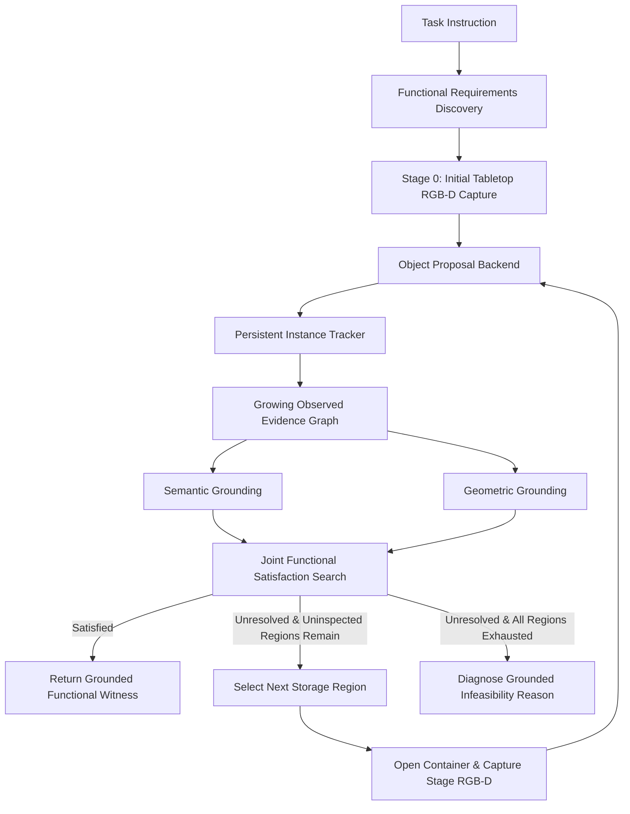

# Workshop (W1) Phase 1 Research Pipeline: Functional Object and Region Grounding

This document describes the complete Phase 1 research pipeline implemented for the Workshop (W1) benchmark.

---

## 1. Problem Formulation & Scope

Phase 1 solves the problem of **joint functional requirement satisfaction and active visual inspection** under strict partial observability and hard privilege boundaries:

$$\text{Given: } \mathcal{T} \text{ (Task instruction)} \implies \Phi = \{r_{\text{driver}}, r_{\text{fastener}}, r_{\text{surface}}, r_{\text{container}}\}$$

At stage $k=0$, the agent observes only the initial tabletop using 5 calibrated RGB-D cameras. If no complete functional witness $w = (d, f, s, c)$ can be verified from current evidence, the agent actively selects unopened storage volumes ($\text{TOOL\_CABINET}$, $\text{LEFT\_DRAWER}$, $\text{RIGHT\_DRAWER}$), opens them, captures localized multi-view RGB-D evidence, fuses persistent object instances into a growing observed graph $G_k$, and re-evaluates joint satisfiability until either:
1. A valid, physically verified functional witness $w^* = (d^*, f^*, s^*, c^*)$ is found (early stopping), OR
2. All accessible inspection volumes are exhausted and a grounded infeasibility reason is diagnosed.

> [!IMPORTANT]
> **Phase 1 Boundary**: This pipeline performs perception, persistent tracking, geometric/semantic grounding, and joint witness search only. It does **not** execute manipulation, pick-and-place trajectories, PDDLStream planning, or physics mutations.

---

## 2. Complete Phase 1 Pipeline Architecture



### 2.1 Component Modules (`mujoco_scenes/workshop_phase1/`)

1. **`types.py`**:
   - Strongly typed dataclasses for `FunctionalRequirement`, `ObservedMask`, `ViewObservation`, `ObservedObjectTrack`, `ObservedRegion`, `FunctionGroundingResult`, `FunctionalWitness`, `InspectionDecision`, `InspectionTrace`, and `EpisodeResult`.
2. **`capture.py` (`ProductionInspectionCapture`)**:
   - Multi-camera visual rendering across 5 cameras (`workshop_camera_front`, `workshop_camera_left`, `workshop_camera_right`, `workshop_camera_top`, `workshop_camera_close`) at $1280 \times 720$.
   - Automatic camera pose restoration and optional oracle segmentation pass.
3. **`perception.py`**:
   - `RGBDConnectedComponentProposalBackend`: Depth-gradient clustering, support plane isolation, 3D volume gating, and CLIP zero-shot classification.
   - `PrivilegedOracleMaskBackend`: Simulator geom-mask generator for upper-bound benchmarking.
4. **`tracking.py` (`PersistentInstanceTracker`)**:
   - Backprojects 2D masks to 3D point clouds using camera intrinsics and extrinsics.
   - 3D spatial clustering with cross-camera centroid distance threshold $\delta = 0.025\,\text{m}$.
   - Monotonic point aggregation, color fusion, and persistent ID assignment (`object_0001`, `object_0002`, ...).
5. **`evidence_graph.py` (`GrowingObservedGraph`)**:
   - Maintains observed objects and candidate regions across stages.
   - Generates sanitized, unprivileged JSON snapshots.
6. **`semantic_grounding.py` (`SemanticGrounder`)**:
   - Evaluates object affordances (`CAN_DRIVE_SCREW`, `CAN_FASTEN`, `WORK_SURFACE`, `SMALL_PARTS_CONTAINER`).
   - Instance-level belief caching with hard query budget limits ($\le 1$ call per episode).
7. **`geometric_grounding.py` (`GeometricGrounder`)**:
   - Tool shaft extraction: Slices point clouds along principal axis, evaluating cylinder radius $\le 0.0035\,\text{m}$ ($7\,\text{mm}$ hole clearance) to determine usable reach $L_{\text{reach}} \ge 0.025\,\text{m}$.
   - Fastener sizing: Computes length $L \ge 0.025\,\text{m}$ and 35th-percentile shaft diameter $D \le 0.008\,\text{m}$.
   - Planar support footprint & relational packing: Evaluates $(A_{\text{driver}} + A_{\text{fastener}}) \times 1.20 \le A_{\text{surface,usable}}$.
8. **`region_grounding.py` (`RegionGrounder`)**:
   - Detects candidate support surfaces (workbench, cart, shelf) and parts containers (bin, tray) from geometric extents.
9. **`functional_search.py` (`FunctionalSatisfactionSearch`)**:
   - Solves joint 4-tuple satisfaction:
     $$(d, f, s, c) \in \mathcal{D}_{\text{driver}} \times \mathcal{D}_{\text{fastener}} \times \mathcal{D}_{\text{surface}} \times \mathcal{D}_{\text{container}}$$
   - If no valid tuple exists, computes exact 7-category grounded rejection diagnoses:
     - `NO_VALID_DRIVER`
     - `NO_VALID_FASTENER`
     - `NO_WORK_SURFACE`
     - `NO_PARTS_CONTAINER`
     - `TOOL_GEOMETRY_FAILURE`
     - `OBJECT_REGION_PACKING_FAILURE`
     - `GLOBAL_CONFLICT`
10. **`inspection_controller.py` (`WorkshopPhase1InspectionController`)**:
    - Orchestrates stage-by-stage loop with early termination upon witness discovery.
11. **`evaluation.py` (`PrivilegedPhase1Evaluator`)**:
    - Post-hoc evaluation computing precision/recall, witness correctness, and rejection diagnosis accuracy using AABB geometric bounding boxes without simulator state contamination during execution.
12. **`serialization.py`**:
    - Sanitizes numpy arrays and enforces zero backend simulator name leakage.

---

## 3. Privilege Boundary Guarantees

The production pipeline strictly adheres to the following rules:
- **No Simulator Oracle Access**: Never calls `WorkshopScene.get_observed_instances()`, `privileged_get_visible_backend_instances()`, `privileged_get_storage_contents()`, `privileged_get_ground_truth_solution()`, or `privileged_get_variant_metadata()`.
- **No Simulator Names**: Discovered tracks use generic identifiers (`object_0001`, `region_0001`). Serialized JSON artifacts contain 0 instances of simulator strings (`workshop_`, `workbench_`, `tool_cabinet`, etc.).
- **Rigorous Auditing**: Audited via `test_workshop_phase1_no_privileged_leaks.py` with static code inspection and dynamic monkeypatch traps.

---

## 4. Benchmark Variants & Evaluation Results

The pipeline was validated across all 14 benchmark variants:

| Variant | Type | Expected Witness / Outcome | Pipeline Result | Rejection Diagnosis | Status |
| :--- | :--- | :--- | :--- | :--- | :--- |
| `F0_BASE` | Feasible | Long Phillips + Med Screw + Workbench + Bin | **FEASIBLE** | None | **PASS** |
| `F1_TOOL_ALTERNATIVE` | Feasible | Power Driver + Med Screw + Workbench + Bin | **FEASIBLE** | None | **PASS** |
| `F2_REGION_ALTERNATIVE` | Feasible | Long Phillips + Med Screw + Mobile Cart + Bin | **FEASIBLE** | None | **PASS** |
| `F3_DISTRIBUTED_OBJECTS` | Feasible | Long Phillips (Cab) + Med Screw (Draw) + Cart + Tray | **FEASIBLE** | None | **PASS** |
| `F4_OBJECT_REGION_COUPLING` | Feasible | Long Phillips (fits) + Med Screw + Shelf + Tray | **FEASIBLE** | None | **PASS** |
| `F5_DECOY_HEAVY` | Feasible | Long Phillips + Med Screw + Workbench + Tray | **FEASIBLE** | None | **PASS** |
| `F6_LAYOUT_SWAPPED` | Feasible | Long Phillips + Med Screw + Workbench + Bin | **FEASIBLE** | None | **PASS** |
| `I0_NO_VALID_DRIVER` | Infeasible | Distractors only (pliers/wrenches) | **INFEASIBLE** | `NO_VALID_DRIVER` | **PASS** |
| `I1_NO_VALID_FASTENER` | Infeasible | Decoy bolts only | **INFEASIBLE** | `NO_VALID_FASTENER` | **PASS** |
| `I2_NO_WORK_SURFACE` | Infeasible | No valid staging surface available | **INFEASIBLE** | `NO_WORK_SURFACE` | **PASS** |
| `I3_NO_PARTS_CONTAINER` | Infeasible | No hardware bin or tray | **INFEASIBLE** | `NO_PARTS_CONTAINER` | **PASS** |
| `I4_TOOL_GEOMETRY_FAILURE` | Infeasible | Stubby driver reach $< 0.025\,\text{m}$ | **INFEASIBLE** | `TOOL_GEOMETRY_FAILURE` | **PASS** |
| `I5_OBJECT_REGION_PACKING_FAILURE` | Infeasible | Power driver + Screw exceeds Shelf area | **INFEASIBLE** | `OBJECT_REGION_PACKING_FAILURE` | **PASS** |
| `I6_GLOBAL_CONFLICT` | Infeasible | Multiple global requirement conflicts | **INFEASIBLE** | `GLOBAL_CONFLICT` | **PASS** |

**Summary**: **14 / 14 Passed (100.0%)** on Oracle backend benchmark.

---

## 5. Running the Pipeline

### Single Variant Execution
```bash
python -m mujoco_scenes.run_workshop_phase1 \
  --variant F0_BASE \
  --mask-backend oracle \
  --output outputs/workshop_phase1/F0_BASE \
  --evaluate
```

### Full Benchmark Suite (All 14 Variants)
```bash
python -m mujoco_scenes.run_workshop_phase1 \
  --variant all \
  --mask-backend oracle \
  --output outputs/workshop_phase1/all_variants \
  --evaluate
```

### Running Test Suites
```bash
# Phase 1 unit and integration tests
pytest mujoco_scenes/tests/test_workshop_phase1.py -v

# Hard privilege boundary and anti-leak tests
pytest mujoco_scenes/tests/test_workshop_phase1_no_privileged_leaks.py -v

# Complete repository regression test suite (644 tests)
pytest mujoco_scenes/tests -q
```
