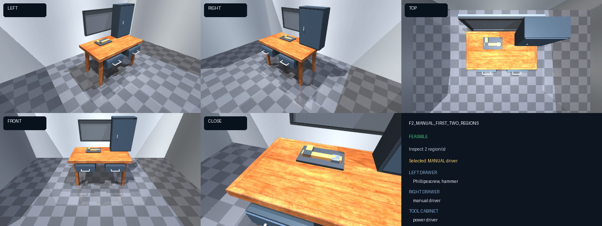
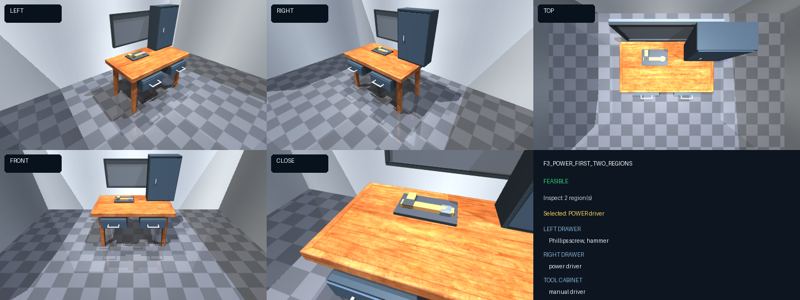
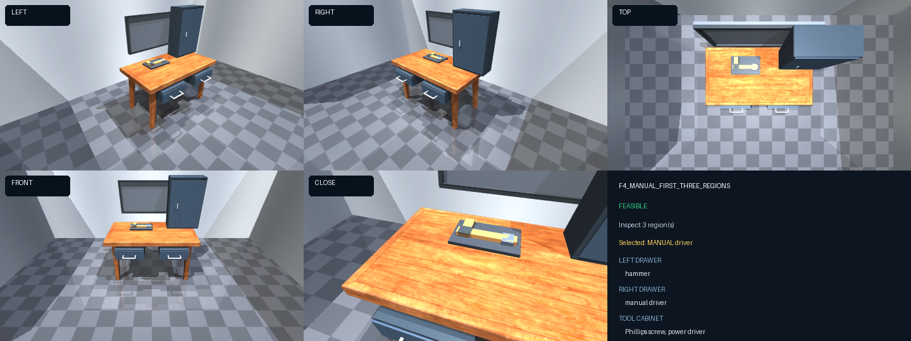
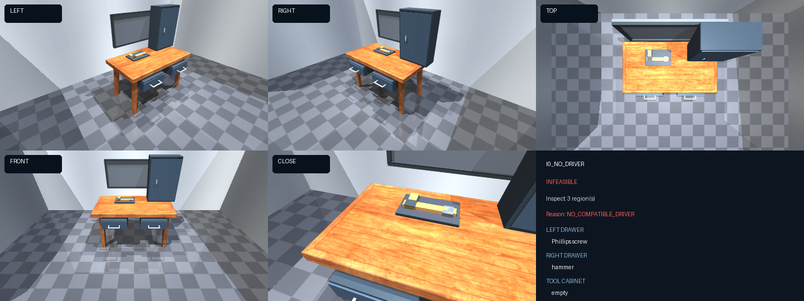

# Workshop Fixed-Object Variant Catalogue

## Frozen benchmark definition

The Workshop benchmark has one task: find the compatible Phillips screw and the first compatible driver encountered in the fixed inspection order, then install the screw into the fixed repair hole on the main workbench.

Only four movable objects exist in this benchmark:

| Object | Functional role | Task use |
|---|---|---|
| Manual Phillips screwdriver | `CAN_DRIVE_SCREW` | The whole driver visibly ratchets about the screw axis while the screw advances. |
| Power driver | `CAN_DRIVE_SCREW` | The casing remains still after engagement while the screw rotates and advances, representing an internal powered spindle. |
| Phillips screw | `CAN_FASTEN` | Inserted tip-down, with its head and Phillips recess facing upward. |
| Wooden hammer | Distractor only | Never selected and never manipulated by the GT task plan. |

Bolts, nuts, pliers, wrenches, alternate fasteners, shelves, region obstructions, and per-variant furniture changes are not part of the redesigned benchmark. The main workbench repair hole is a fixed target rather than a grounding alternative. The tool cart remains fixed scene furniture but is not a task role. Parts trays and hardware bins are disabled.

## What changes between variants

The three fixed inspectable storage regions are searched in this order:

1. `LEFT_DRAWER`
2. `RIGHT_DRAWER`
3. `TOOL_CABINET`

A variant changes only the storage position or presence of the four fixed objects. Search stops as soon as both a screw and a compatible driver have been observed. If both drivers have been observed, the driver encountered first in inspection order is selected. Feasibility never changes because of furniture, surface, container, or obstruction changes.

| Paper label | Internal variant | Left drawer | Right drawer | Tool cabinet | Regions inspected | Result / selected tool |
|---|---|---|---|---|---:|---|
| `W1` | `F0_MANUAL_FIRST_ONE_REGION` | Manual driver, screw | Power driver | Hammer | 1 | Feasible / manual |
| `W2` | `F1_POWER_FIRST_ONE_REGION` | Power driver, screw | Manual driver | Hammer | 1 | Feasible / power |
| `W3` | `F2_MANUAL_FIRST_TWO_REGIONS` | Screw, hammer | Manual driver | Power driver | 2 | Feasible / manual |
| `W4` | `F3_POWER_FIRST_TWO_REGIONS` | Screw, hammer | Power driver | Manual driver | 2 | Feasible / power |
| `W5` | `F4_MANUAL_FIRST_THREE_REGIONS` | Hammer | Manual driver | Screw, power driver | 3 | Feasible / manual |
| `W6` | `F5_POWER_FIRST_THREE_REGIONS` | Power driver | Hammer | Screw, manual driver | 3 | Feasible / power |
| `W7` | `F6_MANUAL_ONLY` | Hammer | Screw | Manual driver | 3 | Feasible / manual; power driver absent |
| `W8` | `F7_POWER_ONLY` | Hammer | Screw | Power driver | 3 | Feasible / power; manual driver absent |
| `W9` | `I0_NO_DRIVER` | Screw | Hammer | Empty | 3 | Infeasible: `NO_COMPATIBLE_DRIVER` |
| `W10` | `I1_NO_SCREW` | Manual driver | Power driver | Hammer | 3 | Infeasible: `NO_COMPATIBLE_SCREW` |

“Feasible” means that the observed objects contain at least one geometrically compatible driver–screw pair and the full insertion sequence can be executed. “Infeasible” means that exhaustive inspection proves a required movable role is absent. It does not mean that perception failed or that a work surface/container alternative happened to be unavailable.

## Ground-truth execution semantics

For a feasible variant, the GT controller opens each required storage region once with the generic `OPEN(region)` action, searches it, retrieves the selected driver and screw, and uses the fixed main workbench target. Opened storage remains open; no close action is part of Workshop GT. Objects staged on the workbench are held at their established support-contact pose so they cannot roll or drift while the robot performs another action.

The screw is aligned vertically over the repair hole, inserted tip-first, and driven gradually. Manual execution uses visible alternating driver rotation; power execution keeps the power-driver casing stationary while the screw rotates and advances. The terminal validator checks inspection coverage, screw verticality, head-above-tip orientation, installed depth, driver–screw compatibility, and the selected driving mode.

For an infeasible variant, all three storage regions are inspected once. No insertion action is attempted, and the exact missing-role reason is reported.

## Five-camera snapshots

Every image shows the initial closed scene in the same five cameras—`LEFT`, `RIGHT`, `TOP`, `FRONT`, and `CLOSE`. The robot must execute `OPEN(region)` to expose a storage region; use `--open-storage` only when deliberately producing an inspection preview. The status panel lists the expected search depth and GT decision.

### F0 — manual, one-region search


### F1 — power, one-region search


### F2 — manual, two-region search



### F3 — power, two-region search



### F4 — manual, three-region search



### F5 — power, three-region search


### F6 — manual-only feasible case


### F7 — power-only feasible case


### I0 — no compatible driver



### I1 — no screw


## Reproduction

The authoritative matrix is `mujoco_scenes/configs/workshop_variants.yaml`. Regenerate these images with:

```bash
.venv/bin/python -m mujoco_scenes.render_workshop_variant_catalogue
```

The machine-readable image index is `docs/workshop_variant_visualizations/manifest.json`.
