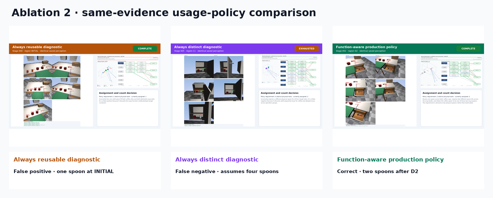

# Ablation 2: function-aware utensil reuse

This report demonstrates that raw utensil count is not sufficient. Reuse is
declared per function group:

- coffee: one spoon may be reused across two target cups;
- soup: each of two bowls requires a different spoon;
- cross-group reuse: the coffee spoon may also serve one soup bowl.

All policy modes use identical saved perception evidence.

| Mode | Outcome | Completion stage | Policy distinct requirement | Assigned distinct | Expected matched |
|---|---:|---:|---:|---:|---:|
| Always reusable diagnostic | COMPLETE | 0 | 1 | 1 | YES |
| Always distinct diagnostic | EXHAUSTED | None | 4 | 2 | YES |
| Function-aware production policy | COMPLETE | 2 | 2 | 2 | YES |

## Animations

- [Always reusable GIF](ablations/always_reusable/always_reusable.gif) · [MP4](ablations/always_reusable/always_reusable.mp4)
- [Always distinct GIF](ablations/always_distinct/always_distinct.gif) · [MP4](ablations/always_distinct/always_distinct.mp4)
- [Function-aware GIF](ablations/function_aware/function_aware.gif) · [MP4](ablations/function_aware/function_aware.mp4)

Open `presentation_report.html` for the self-contained presentation with scene
views, overlays, point clouds, graphs, assignments, and numeric margins.
