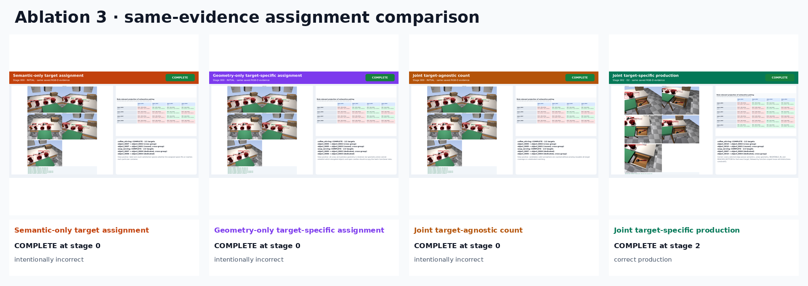
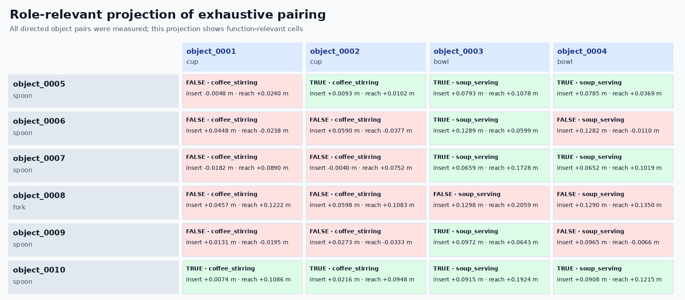
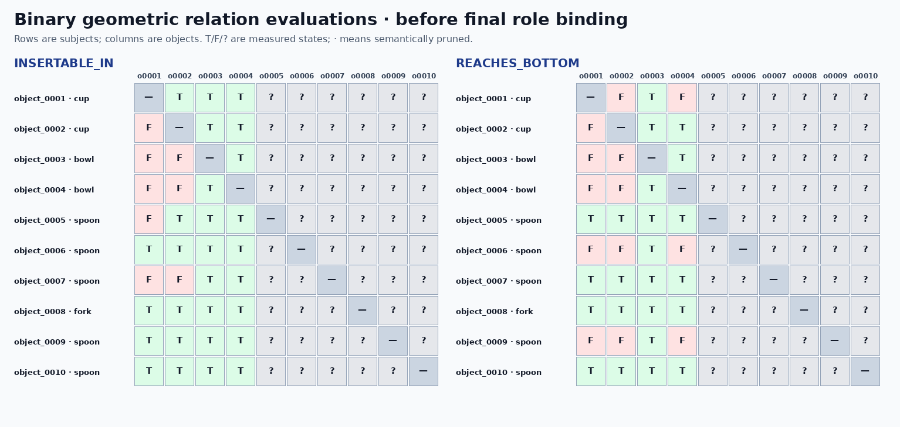

# Ablation 3: multi-target semantic–geometric assignment

Compatibility is evaluated as `VALID_FOR(tool, function, target)`, not as a global `VALID_TOOL(tool)` flag. Reuse/distinctness belongs to each task-level function group.

Every observed object is checked against every unary role requirement and every distinct ordered object pair is checked geometrically before any function role is assigned. The matrix PNG is the readable role-relevant projection; the HTML table and machine-readable JSON/CSV retain the complete all-object function-pair evaluation.

| Mode | Outcome | Completion stage | Scientifically correct? | Expected matched? |
|---|---:|---:|---:|---:|
| Semantic-only target assignment | COMPLETE | 0 | No | Yes |
| Geometry-only target-specific assignment | COMPLETE | 0 | No | Yes |
| Joint target-agnostic count | COMPLETE | 0 | No | Yes |
| Joint target-specific production | COMPLETE | 2 | Yes | Yes |

## Animations

- [Semantic-only target assignment GIF](ablations/semantic_only/semantic_only.gif) · [MP4](ablations/semantic_only/semantic_only.mp4)
- [Geometry-only target-specific assignment GIF](ablations/geometry_only/geometry_only.gif) · [MP4](ablations/geometry_only/geometry_only.mp4)
- [Joint target-agnostic count GIF](ablations/joint_target_agnostic_count/joint_target_agnostic_count.gif) · [MP4](ablations/joint_target_agnostic_count/joint_target_agnostic_count.mp4)
- [Joint target-specific production GIF](ablations/joint_target_specific/joint_target_specific.gif) · [MP4](ablations/joint_target_specific/joint_target_specific.mp4)

Open `presentation_report.html` for the self-contained report with all stage views, detector overlays, point clouds, graph images, numeric measurements, pairwise margins, assignments, GIFs, and MP4s.
