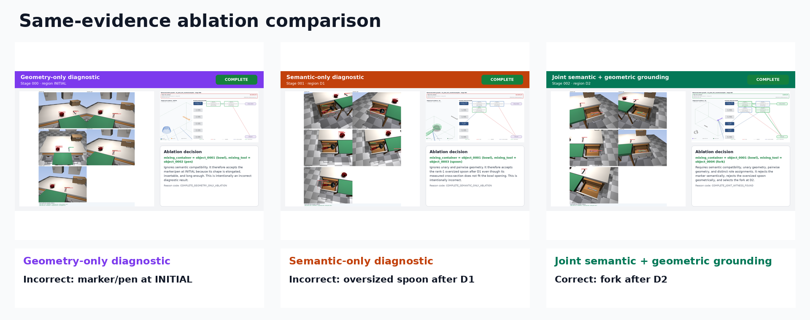
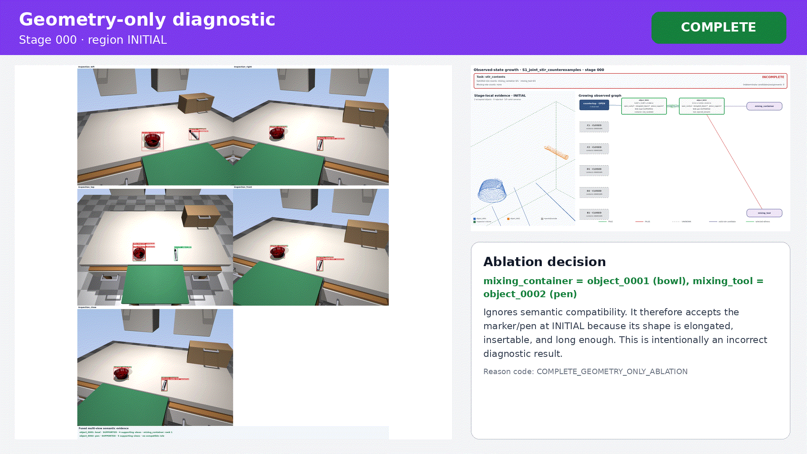
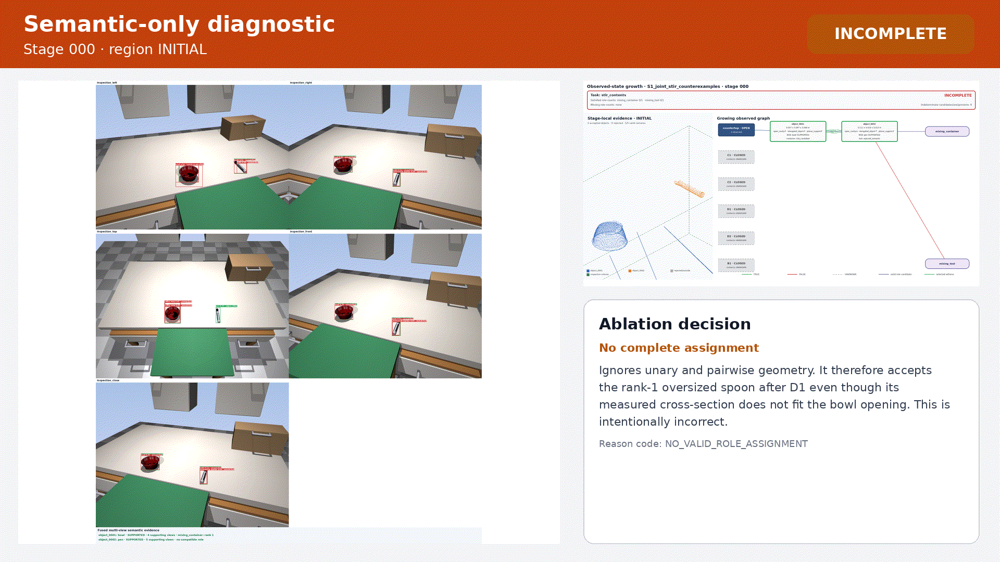
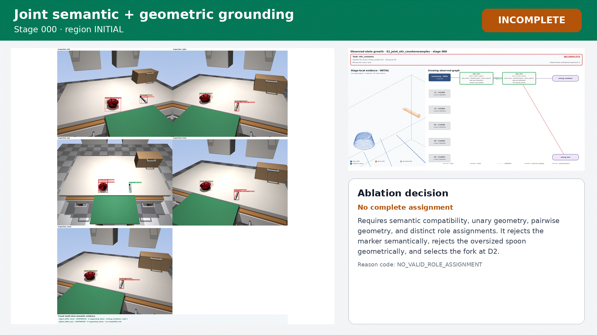
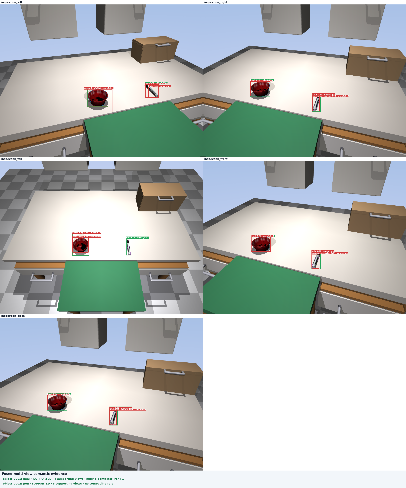
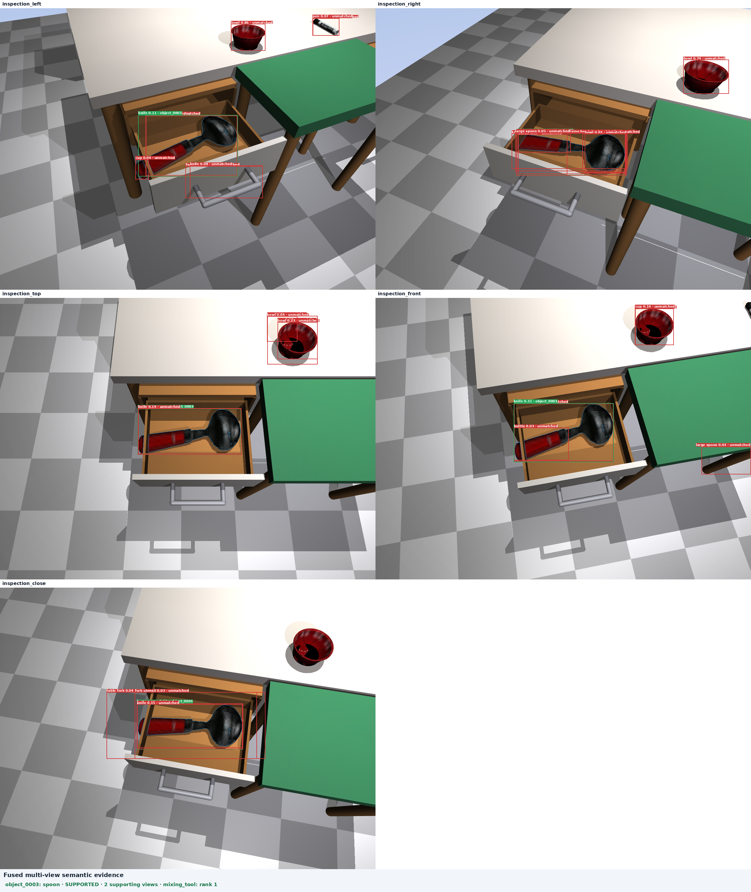
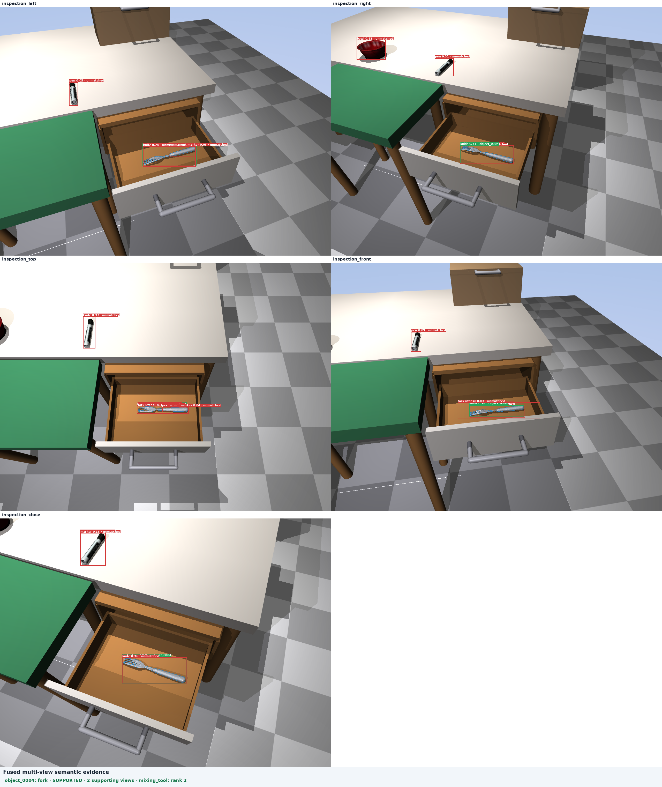

# Joint semantic–geometric grounding report

[Download the self-contained presentation](presentation_report.html) · [Machine-readable evaluation](offline_ablation_evaluation.json)

- Scene: `S1_joint_stir_counterexamples`
- Task: `stir_contents`
- Source run ID: `qualitative_unary_demo`
- Same saved observation evidence used by all modes: `true`
- All expected outcomes matched: `True`

## What was done

The scene was captured once per stage with five region-facing cameras. RGB supplied semantic evidence; metric depth and instance masks supplied fresh stage-local point-cloud evidence. Geometry-only and semantic-only are diagnostic acceptance ablations over those same saved observations. Only joint mode is the production decision.

## Outcomes

| Mode | Completion | Selection | Correct? |
|---|---:|---|---|
| Geometry-only diagnostic | stage 0 | `{'mixing_container': 'bowl', 'mixing_tool': 'pen'}` | False |
| Semantic-only diagnostic | stage 1 | `{'mixing_container': 'bowl', 'mixing_tool': 'spoon'}` | False |
| Joint semantic + geometric grounding | stage 2 | `{'mixing_container': 'bowl', 'mixing_tool': 'fork'}` | True |

## Visualizations

### Geometry-only diagnostic

Ignores semantic compatibility. It therefore accepts the marker/pen at INITIAL because its shape is elongated, insertable, and long enough. This is intentionally an incorrect diagnostic result.

[Open the geometry-only MP4](ablations/geometry_only/geometry_only.mp4)

### Semantic-only diagnostic

Ignores unary and pairwise geometry. It therefore accepts the rank-1 oversized spoon after D1 even though its measured cross-section does not fit the bowl opening. This is intentionally incorrect.

[Open the semantic-only MP4](ablations/semantic_only/semantic_only.mp4)

### Joint semantic + geometric grounding

Requires semantic compatibility, unary geometry, pairwise geometry, and distinct role assignments. It rejects the marker semantically, rejects the oversized spoon geometrically, and selects the fork at D2.

[Open the joint MP4](ablations/joint/joint.mp4)

## Captured scene stages

### Stage 000: 000_initial

[Open point-cloud and graph overview](stages/000_initial/overview.png)

### Stage 001: 001_after_D1

[Open point-cloud and graph overview](stages/001_after_D1/overview.png)

### Stage 002: 002_after_D2

[Open point-cloud and graph overview](stages/002_after_D2/overview.png)

## Machine-readable evidence

- [Offline ablation evaluation](offline_ablation_evaluation.json)
- [Complete report data](report_data.json)
- Raw point-cloud run artifacts are intentionally not committed in this presentation package.
