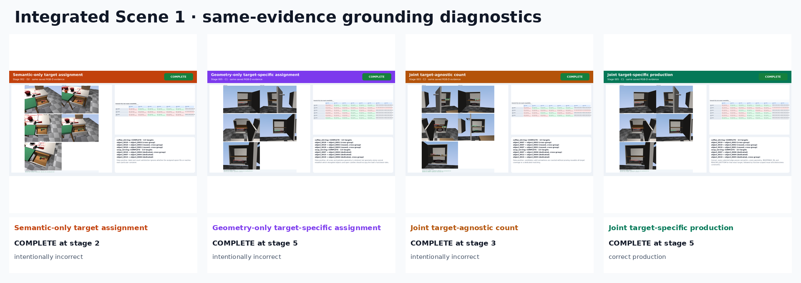
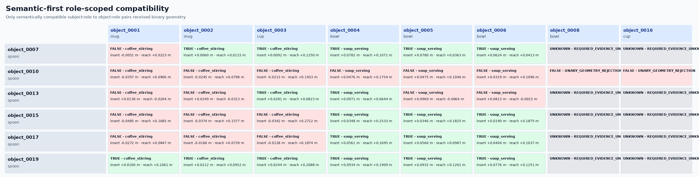
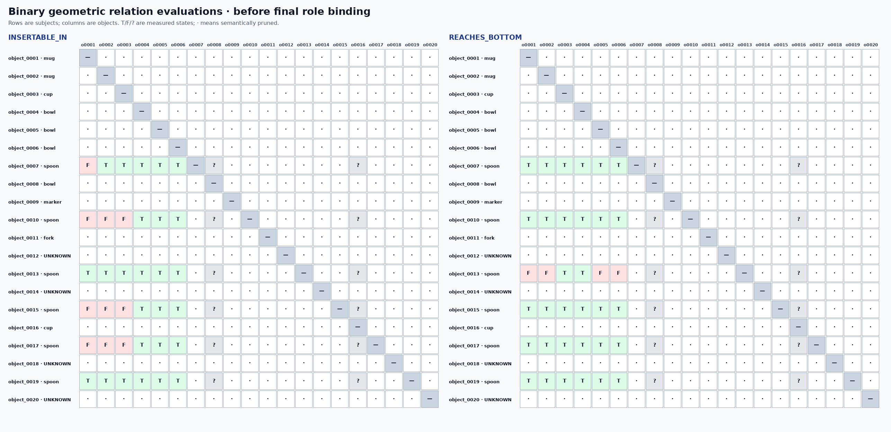

# Integrated Scene 1: kitchen object–function stress test

Goal: Prepare and serve coffee and soup for three people using the available kitchenware. Stir all three coffees and provide each soup bowl with a suitable utensil. Search the closed kitchen storage for anything still required.

Compatibility is evaluated as `VALID_FOR(tool, function, target)`, not as a global `VALID_TOOL(tool)` flag. Reuse/distinctness belongs to each task-level function group.

Every observed object is checked against every unary role requirement. Exhaustive pairing evaluates every distinct ordered object pair; production semantic-first pairing evaluates only relation-directed pairs whose endpoints have reliable compatible role semantics. The two strategies are reconstructed from the same cached evidence and compared explicitly. The matrix PNG is the readable role-relevant projection; the HTML table and machine-readable JSON/CSV retain evaluated and explicitly pruned function-pair cells.

| Mode | Outcome | Completion stage | Scientifically correct? | Expected matched? |
|---|---:|---:|---:|---:|
| Semantic-only target assignment | COMPLETE | 2 | No | Yes |
| Geometry-only target-specific assignment | COMPLETE | 5 | No | Yes |
| Joint target-agnostic count | COMPLETE | 3 | No | Yes |
| Joint target-specific production | COMPLETE | 5 | Yes | Yes |

## Animations

- [Semantic-only target assignment GIF](ablations/semantic_only/semantic_only.gif) · [MP4](ablations/semantic_only/semantic_only.mp4)
- [Geometry-only target-specific assignment GIF](ablations/geometry_only/geometry_only.gif) · [MP4](ablations/geometry_only/geometry_only.mp4)
- [Joint target-agnostic count GIF](ablations/joint_target_agnostic_count/joint_target_agnostic_count.gif) · [MP4](ablations/joint_target_agnostic_count/joint_target_agnostic_count.mp4)
- [Joint target-specific production GIF](ablations/joint_target_specific/joint_target_specific.gif) · [MP4](ablations/joint_target_specific/joint_target_specific.mp4)

Open `presentation_report.html` for the self-contained report with all stage views, detector overlays, point clouds, graph images, numeric measurements, pairwise margins, assignments, GIFs, and MP4s.
